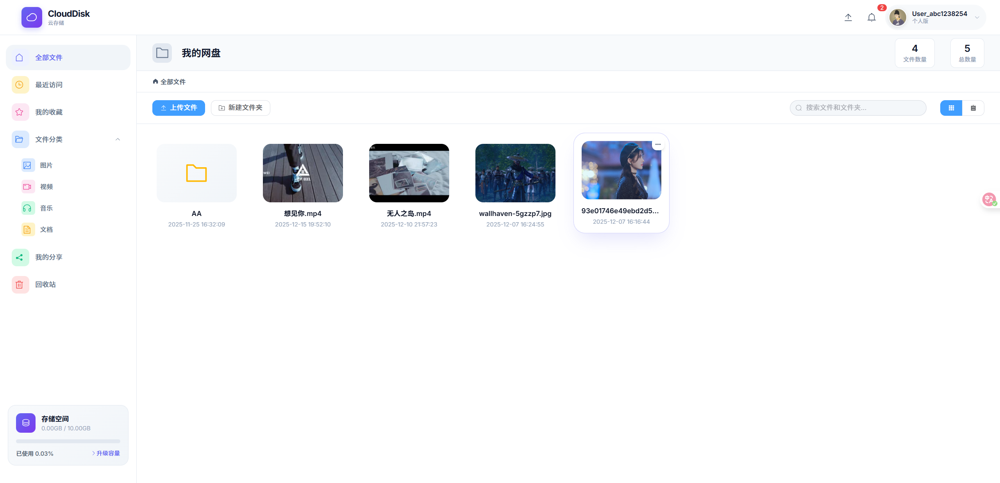
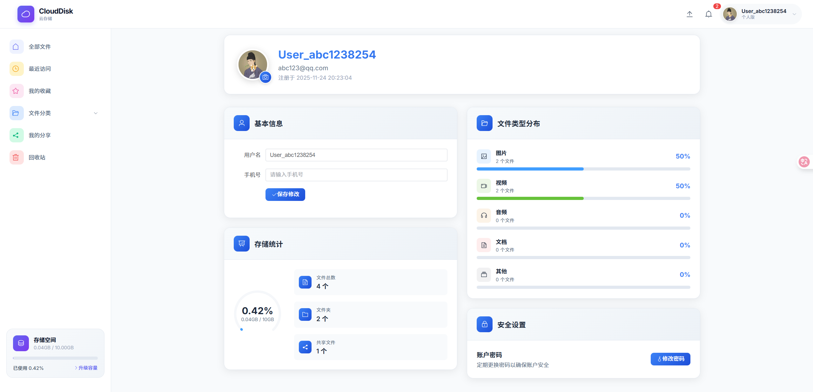
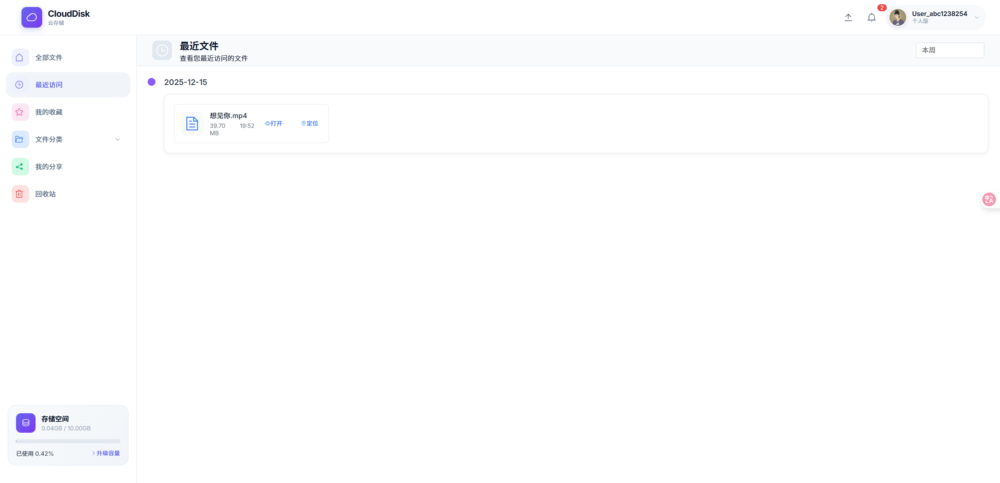
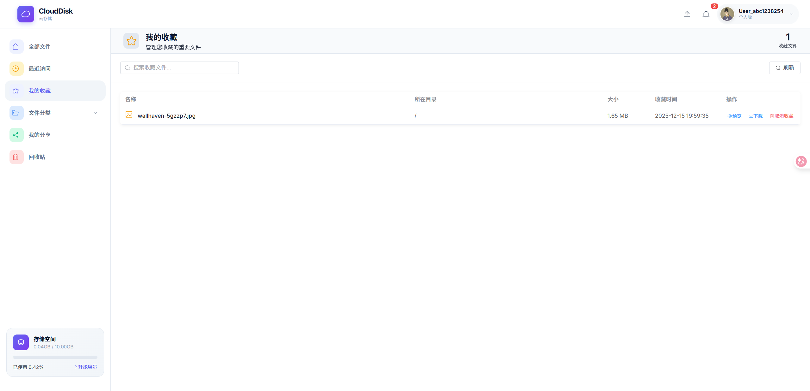
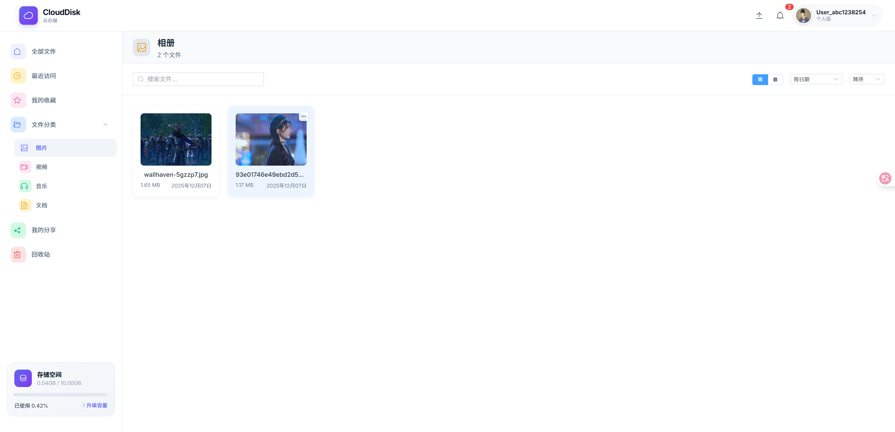
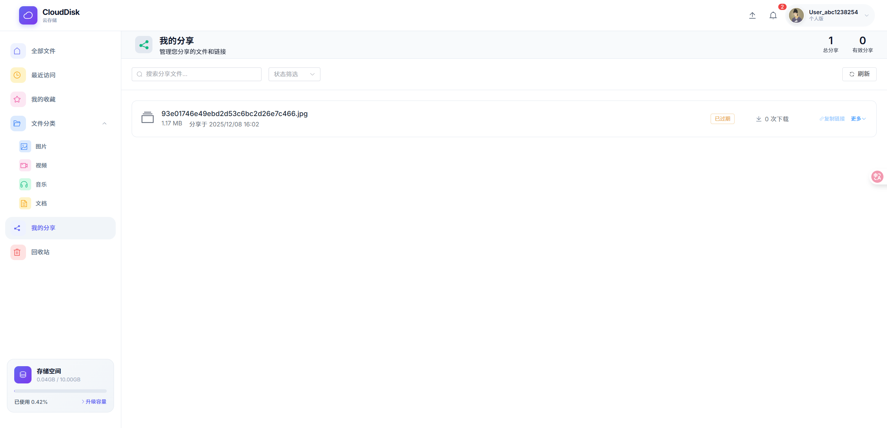
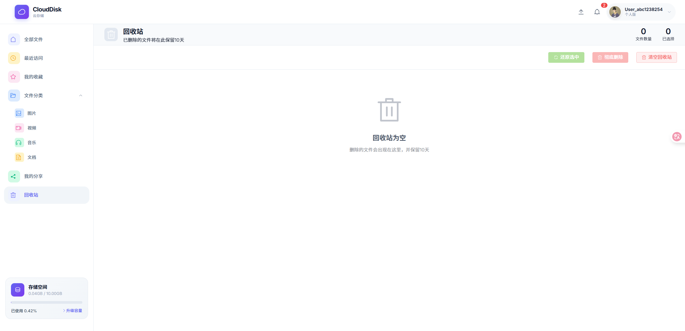

# Go Cloud Storage - 云存储系统


Go Cloud Storage 是一个前后端分离的私有网盘项目，支持账号认证、文件上传下载、分片续传、文件预览、收藏、分享、回收站与容量统计。

系统采用 **Go + Gin + GORM + MySQL + Redis + MinIO + RabbitMQ** 构建后端服务，前端基于 **Vue 3 + Vuex + Element Plus + Vue CLI** 实现，适合作为网盘/对象存储类项目的学习与二次开发基础。

## ✨ 项目特色

- 文件能力完整：支持普通上传、大文件分片上传、断点续传、秒传校验、在线预览与下载。
- 存储解耦：文件元数据存储在 MySQL，对象文件存储在 MinIO。
- 回收站机制：支持软删除、恢复、彻底删除，支持过期自动清理（可接入 RabbitMQ 异步任务）。
- 社交分享：支持创建分享链接、公开访问、下载统计与分享管理。
- 用户与容量管理：支持注册登录、头像与密码修改、容量配额与统计看板。
- 前后端分离：后端 API 与前端 SPA 解耦，便于独立开发、部署与扩展。

## 📸 系统预览

保留项目原有界面展示如下：









## 🔧 技术栈

### 后端

- 语言：Go 1.24+
- 框架：Gin
- ORM：GORM
- 数据库：MySQL
- 缓存：Redis
- 对象存储：MinIO
- 消息队列：RabbitMQ（可选启用）
- 认证：JWT

### 前端

- 框架：Vue 3
- 构建工具：Vue CLI 5
- 状态管理：Vuex 4
- UI 组件库：Element Plus
- 请求库：Axios

## 🚀 快速开始

请按以下步骤在本地运行项目。

### 1. 克隆项目

```bash
git clone <your-repo-url>
cd go-cloud-storage
```

### 2. 准备数据库

项目根目录提供建表与示例数据 SQL：

- `db.sql`

在 MySQL 中创建数据库后导入：

```sql
source db.sql;
```

### 3. 配置后端

编辑配置文件：

- `conf/go-cloud-storage.dev.yaml`

请根据本地环境配置以下内容：

- MySQL (`Database`)
- Redis (`Redis`)
- MinIO (`minio`)
- RabbitMQ（可选，`rabbitmq.enabled=true` 时生效）
- 服务端口 (`Server.port`)

### 4. 启动后端服务

```bash
go mod tidy
go run main.go
```

默认监听 `:8081`（以配置文件为准）。

### 5. 启动前端服务

```bash
cd front
npm install
npm run serve
```

默认访问地址通常为：`http://localhost:8080`

## 📂 项目结构

### 高层结构

```text
go-cloud-storage/
├── conf/                        # 后端配置
├── internal/                    # 后端核心代码
├── front/                       # Vue 前端项目
├── image/                       # README 展示图片
├── db.sql                       # 数据库脚本
├── main.go                      # 后端入口
└── README.md
```

### 后端核心结构

```text
internal/
├── controller/                  # HTTP 控制器
├── middleware/                  # 中间件（JWT 等）
├── models/                      # 数据模型与 DTO/VO
├── pkg/                         # 基础能力（config/mysql/cache/minio/mq/utils）
├── repositories/                # 数据访问层
├── services/                    # 业务服务层
└── router/                      # 路由与服务装配
```

### 前端核心结构

```text
front/src/
├── api/                         # 接口请求封装
├── components/                  # 公共组件
├── router/                      # 前端路由
├── store/                       # Vuex 状态管理
├── utils/                       # 工具函数
└── views/                       # 页面视图
```

## 🚀 后端核心系统详解

核心分层如下：

- API 层（controller）：对外提供登录、文件、收藏、分享、回收站、统计等接口。
- 业务层（services）：封装文件上传、分片合并、分享与回收站等核心业务。
- 数据层（repositories + models）：通过 GORM 操作 MySQL。
- 存储层（pkg/minio）：封装对象上传、下载、删除与缩略图逻辑。
- 消息层（pkg/mq）：封装 RabbitMQ 发布/消费，用于回收站过期清理解耦。

关键模块：

- `main.go`：启动入口，初始化配置、数据库、缓存、MinIO、RabbitMQ 与路由。
- `internal/router/router.go`：依赖装配、路由注册、后台任务启动。
- `internal/services/file_service.go`：文件上传、分片、移动、搜索、预览。
- `internal/services/recycle_service.go`：回收站编排逻辑与过期任务分发。
- `internal/services/recycle_purge_service.go`：文件彻底删除统一执行逻辑。

## 🧩 前端模块说明

- `front/src/views/MyDrive.vue`：网盘主页面（文件列表、上传、搜索、操作）。
- `front/src/views/Recycle.vue`：回收站页面（恢复、批量删除、清空）。
- `front/src/views/SharedFiles.vue`：分享管理页面。
- `front/src/views/StarredFiles.vue`：收藏管理页面。
- `front/src/components/common/PageHeader.vue`：通用页面头组件。

## 🔐 API 概览

后端主要接口包括：

- 认证：`/login`、`/register`、`/refresh-token`、`/logout`
- 用户：`/me`、`/user/update`、`/user/password`、`/user/avatar`
- 文件：`/file/list`、`/file/upload`、`/file/chunk/*`、`/file/search`、`/file/download/:fileId`
- 收藏：`/favorite`
- 回收站：`/recycle`、`/recycle/:fileId`、`/recycle/batch`
- 分类：`/category/files`
- 分享：`/share`、`/s/:token`

## 📜 部署建议

- 后端：可通过 systemd / Docker / 进程管理器部署 Go 服务。
- 前端：执行 `npm run build` 后将 `front/dist` 部署到 Nginx 等静态服务器。
- 数据层：MySQL、Redis、MinIO、RabbitMQ 建议独立部署并配置备份与监控。

## 🙏 致谢

感谢 Go、Gin、GORM、Vue、Element Plus、MinIO、RabbitMQ 等开源项目。

## 📄 许可证

本项目采用 MIT 许可证，详见 `LICENSE`。
