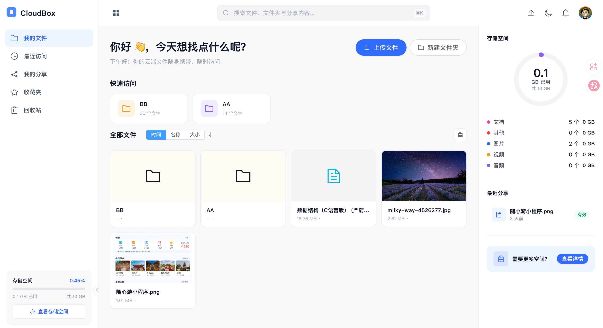
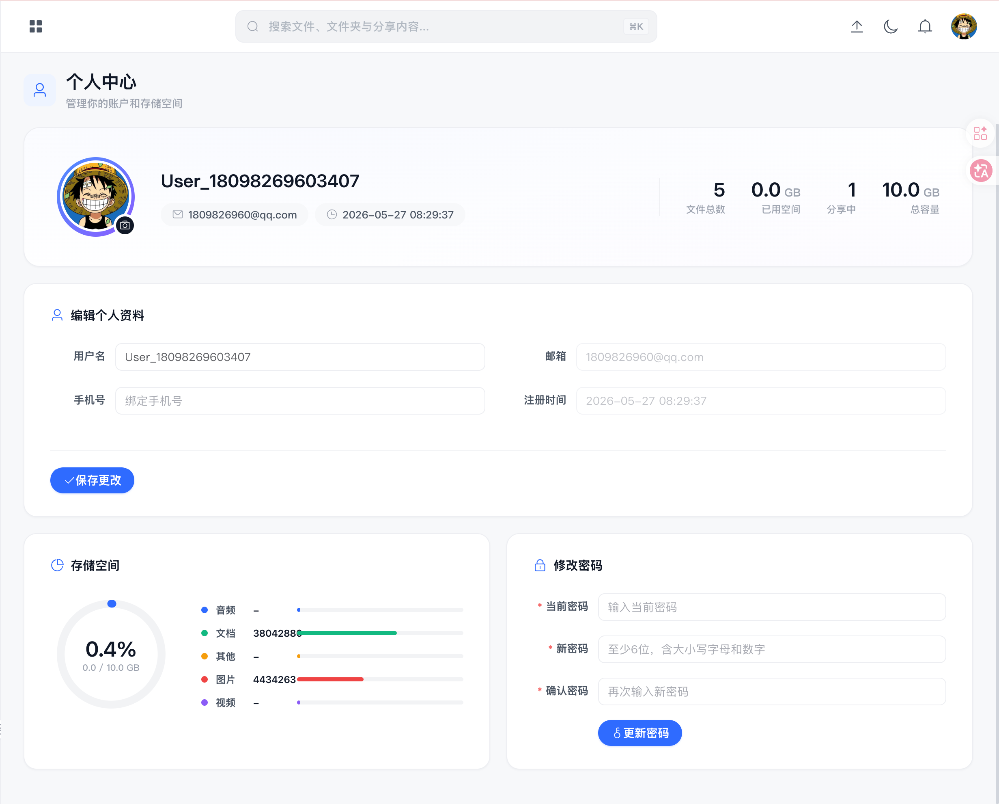
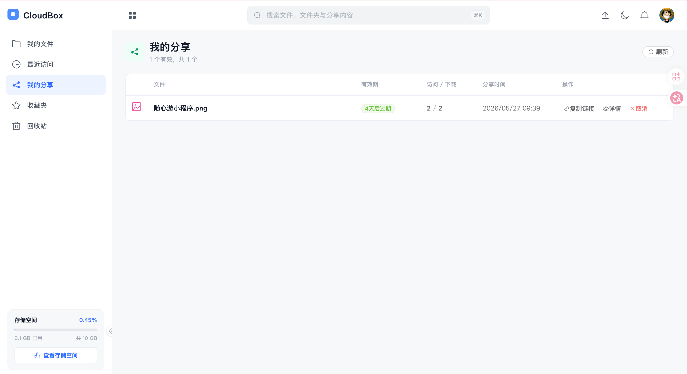
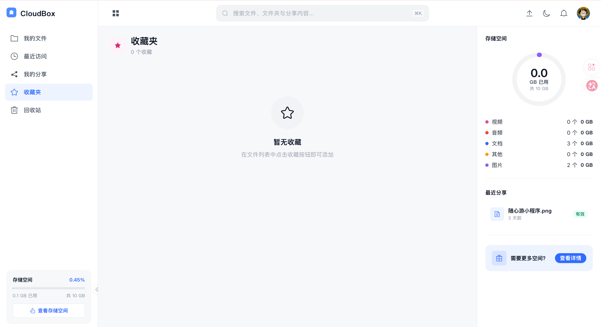
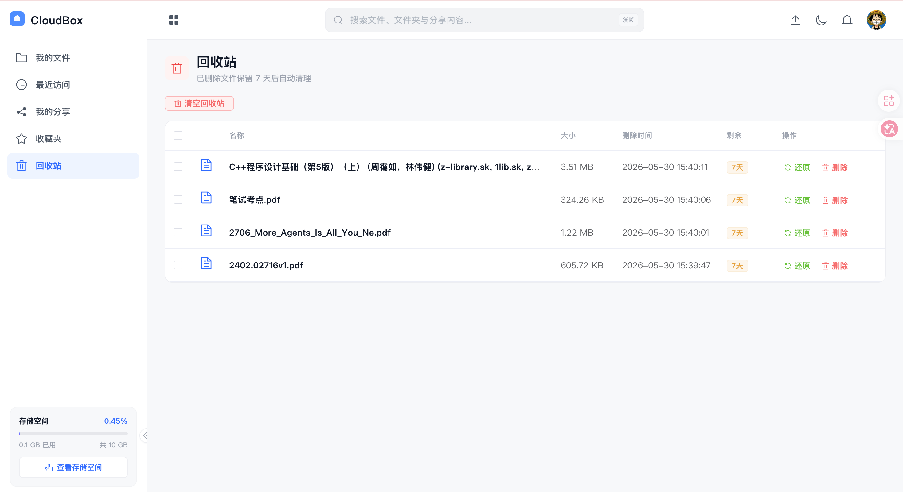
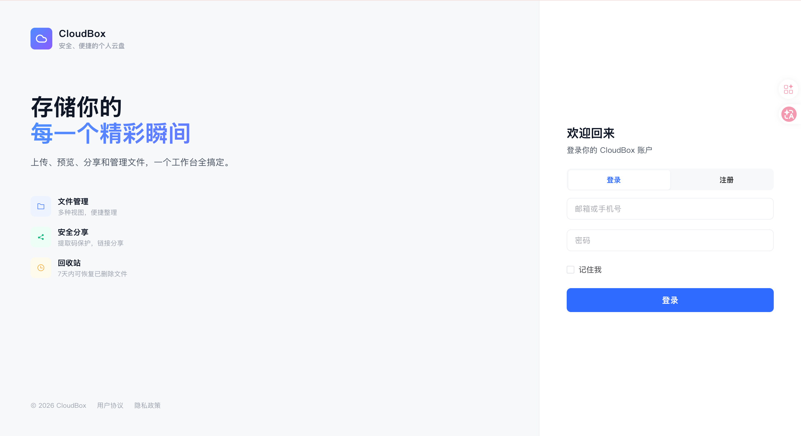

# Go Cloud Storage

<p align="center">
  <strong>高性能私有云存储系统</strong> — 前后端分离，支持大文件分片上传、秒传、实时通知、文件分享与协作
</p>

<p align="center">
  
  
  
  
  
  
</p>

## 预览

| 文件管理 | 个人中心 | 分享管理 |
|:---:|:---:|:---:|
|  |  |  |

| 收藏夹 | 回收站 | 登录注册 |
|:---:|:---:|:---:|
|  |  |  |

## 功能

- **用户认证** — 注册 / 登录 / JWT Token 刷新 / 退出，密码强度校验
- **文件管理** — 文件夹树、拖拽移动、复制、重命名、删除
- **大文件上传** — 分片初始化 → 并发上传 → 合并，支持断点续传与秒传
- **文件预览** — 图片轮播、视频/音频播放、Markdown 渲染、PDF 内嵌预览、文本/代码高亮
- **搜索** — 全文搜索（MySQL ngram 索引支持中文），搜索历史（Redis ZSet）
- **下载** — Range 分段下载（>100MB 走 MinIO 预签名直链），下载信息面板
- **收藏与分类** — 收藏夹管理，按文件类型（图片/视频/文档/其他）分类浏览
- **分享** — 创建分享链接（提取码 + 有效期 + 下载权限），提取码暴力破解防护
- **回收站** — 软删除、单个/批量恢复、自动过期清理（RabbitMQ 延迟队列）
- **存储统计** — 环形图容量展示，按文件类型分别统计，实时刷新
- **实时通知** — SSE 服务端推送，分享/系统通知即时到达
- **安全机制** — API 速率限制、文件类型白名单、文件大小上限、上传校验
- **键盘快捷键** — 支持 `Ctrl+F` 搜索、`Ctrl+O` 上传等快捷操作

## 技术栈

| 层级 | 技术 |
|:---|:---|
| 后端框架 | Go 1.25 · Gin · GORM |
| 数据库 | MySQL 8 · Redis 7 |
| 对象存储 | MinIO（S3 兼容） |
| 消息队列 | RabbitMQ（可选，关闭后回收站使用定时扫描） |
| 前端框架 | Vue 3 · Vue Router · Vuex · Element Plus |
| 构建工具 | Vue CLI 5 · npm |

## 项目结构

```
go-cloud-storage/
├── backend/
│   ├── cmd/main.go                 # 启动入口
│   ├── conf/                       # YAML 配置文件
│   ├── infrastructure/             # 基础设施层
│   │   ├── cache/                  #   Redis 客户端
│   │   ├── minio/                  #   MinIO 客户端（分片/缩略图/预签名）
│   │   ├── mq/                     #   RabbitMQ 客户端
│   │   └── mysql/                  #   MySQL 连接
│   ├── internal/
│   │   ├── controller/             # HTTP 接口层
│   │   ├── services/               # 业务编排层
│   │   ├── repositories/           # 数据访问层
│   │   ├── models/                 # 数据模型与 DTO
│   │   ├── middleware/             # JWT / 限流 / 暴力破解防护
│   │   └── router/                 # 依赖装配与路由注册
│   └── pkg/
│       ├── config/                 # 配置加载（Viper）
│       ├── logger/                 # 结构化日志（slog）
│       └── utils/                  # JWT / 响应封装 / 格式化
├── front/
│   └── src/
│       ├── api/                    # 后端 API 封装
│       ├── components/layout/      # 布局组件（Header/Sidebar/RightPanel）
│       ├── router/                 # 前端路由
│       ├── store/modules/          # Vuex 状态模块
│       ├── utils/                  # 请求拦截器、工具函数
│       └── views/                  # 页面视图
├── image/                          # README 截图
├── db.sql                          # 数据库初始化脚本
└── README.md
```

## 快速开始

### 环境要求

| 依赖 | 版本 |
|:---|:---|
| Go | ≥ 1.25 |
| Node.js | ≥ 18（推荐 24） |
| MySQL | ≥ 8.0 |
| Redis | ≥ 7.0 |
| MinIO | latest |
| RabbitMQ | 3.x（可选） |

### 1. 初始化数据库

```bash
mysql -u root -p -e "CREATE DATABASE IF NOT EXISTS \`file-store\` DEFAULT CHARACTER SET utf8mb4;"
mysql -u root -p file-store < db.sql
```

为提高中文搜索准确性，创建 ngram 全文索引：

```sql
ALTER TABLE `file` ADD FULLTEXT INDEX `ft_name` (`name`) WITH PARSER ngram;
```

### 2. 配置后端

编辑 `backend/conf/go-cloud-storage.dev.yaml`，按实际环境修改：

```yaml
Server:
  port: 8081

Database:
  host: 127.0.0.1
  port: 3306
  user: root
  password: your_password
  dbname: file-store

Redis:
  host: 127.0.0.1
  port: 6379
  password: your_password

minio:
  endpoint: "127.0.0.1:9000"
  accessKeyID: "minioadmin"
  secretAccessKey: "minioadmin"
  bucket: "go-cloud-storage"
  useSSL: false

rabbitmq:
  enabled: false   # 不使用可关闭
```

### 3. 启动后端

```bash
cd backend
go mod tidy
go run ./cmd
```

服务默认运行在 `http://localhost:8081`。

### 4. 启动前端

```bash
cd front
npm install
npm run serve
```

浏览器打开 `http://localhost:8080`。

> 前端 API 地址在 `front/src/utils/request.js` 中配置，默认指向 `http://localhost:8081`。

## API 概览

| 模块 | 端点 | 说明 |
|:---|:---|:---|
| 认证 | `POST /login` `/register` `/refresh-token` `/logout` | 登录、注册、刷新令牌、退出 |
| 用户 | `GET /me` `PUT /user/update` `/password` `/avatar` `/stats` | 个人信息、密码修改、头像上传、统计 |
| 文件 | `POST /file/list` `/upload` `/create-folder` `/search` | 列表、上传、创建文件夹、搜索 |
| 分片 | `POST /file/chunk/init` `/upload` `/merge` `/cancel` | 大文件分片上传 |
| 预览 | `GET /file/preview/:id` `/preview-stream/:id` | 文件预览（含 PDF 代理流） |
| 下载 | `GET /file/download/:id` `/download-info/:id` | 下载、下载策略信息 |
| 操作 | `POST /file/move` `/copy` `/rename` `DELETE /file/:id` | 移动、复制、重命名、删除 |
| 收藏 | `GET/POST/DELETE /favorite` | 收藏管理 |
| 分类 | `POST /category/files` | 按类型分类浏览 |
| 回收站 | `GET /recycle` `PUT /recycle/:id/restore` `DELETE /recycle` | 列表、恢复、删除/清空 |
| 分享 | `POST /share` `GET /share` `PUT /share/:id` | 创建、列表、更新 |
| 公开 | `GET /s/:token` `/s/:token/download` | 公开访问分享 |
| 通知 | `GET /notification/stream` `GET /notification` | SSE 实时推送、通知列表 |
| 搜索历史 | `GET/DELETE /file/search/history` | 搜索历史管理 |

## 架构设计

```
┌──────────────┐     ┌──────────────────────────────┐     ┌───────────┐
│   Vue 3      │────▶│  Gin API Server              │────▶│  MySQL    │
│   SPA        │     │                              │     │  (主存储)  │
└──────────────┘     │  Controller → Service → Repo  │     └───────────┘
                     │                              │
                     │  ┌────────┐  ┌───────────┐  │     ┌───────────┐
                     │  │ MinIO  │  │  Redis    │  │     │  RabbitMQ │
                     │  │(对象存储)│  │(缓存/会话) │  │     │(延迟清理) │
                     │  └────────┘  └───────────┘  │     └───────────┘
                     └──────────────────────────────┘
```

- **分片上传** — 前端 SparkMD5 计算文件指纹，Redis 维护上传会话与分片 ETag，MinIO Core API 完成分片合并
- **秒传** — 文件指纹命中已有记录时，直接复用 MinIO 对象创建新记录，无需重复上传
- **PDF 预览** — 后端代理流式传输，显式 `Content-Disposition: inline`，避免浏览器弹出下载
- **Office 预览** — 依赖 Microsoft Office Online 服务，需 MinIO 公网可达，当前默认关闭
- **回收站** — 软删除 + 7 天过期，RabbitMQ 延迟消息驱动清理，关闭时降级为定时扫描

## License

MIT
