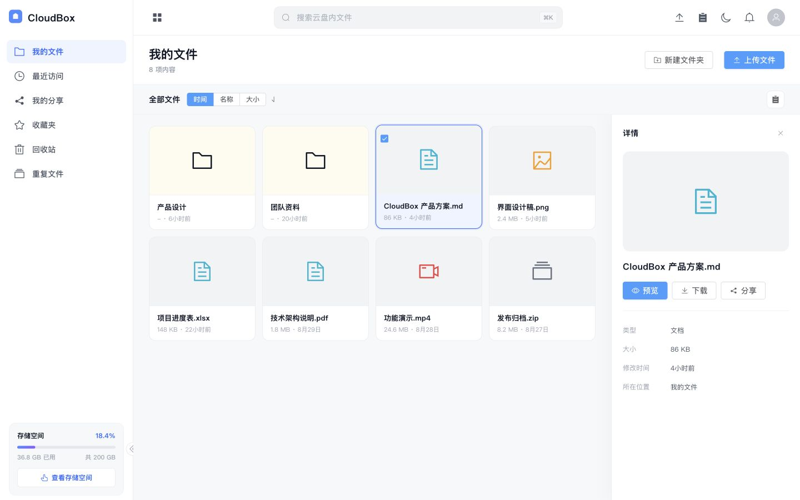
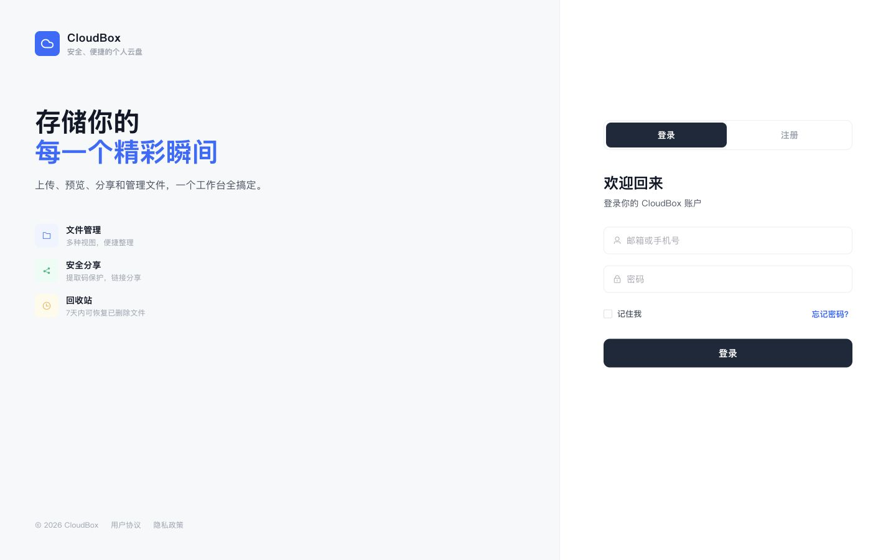
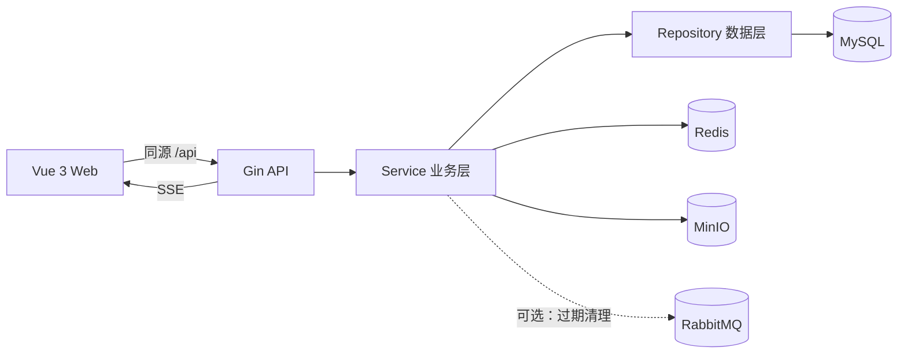

<div align="center">
  
  <h1>Go Cloud Storage</h1>
  <p><strong>CloudBox —— 一个面向 Web 的现代化私有云盘。</strong></p>
  <p>使用 Go、Vue 3 与 MinIO 构建，覆盖文件上传、在线预览、搜索、分享、回收站和实时通知。</p>

  <p>
    
    
    
    
    
  </p>

  <p>
    <a href="#界面预览">界面预览</a> ·
    <a href="#功能亮点">功能亮点</a> ·
    <a href="#快速开始">快速开始</a> ·
    <a href="#架构">架构</a> ·
    <a href="#api-概览">API</a>
  </p>
</div>

## 项目简介

Go Cloud Storage 是一个前后端分离的私有云存储项目，产品界面名称为 **CloudBox**。它以桌面 Web 文件工作区为核心，后端负责认证、文件元数据、对象存储编排与权限校验，前端提供网格/列表浏览、详情面板、上传队列和预览体验。

项目适合用于学习完整的云盘业务链路、自托管实验以及在此基础上继续开发。目前仅维护 **Web 桌面端**，不包含移动端页面或移动端适配承诺。

## 界面预览

### 文件工作区

网格与列表双视图、文件详情、排序、搜索、上传和批量操作集中在同一个桌面工作区中。



### 登录与注册

登录、注册、忘记密码与重置密码使用统一的认证体验。



> 截图基于当前代码的 1440 × 900 桌面 Web 界面生成；示例文件和容量数据仅用于展示。

## 功能亮点

| 能力 | 说明 |
| --- | --- |
| 文件工作区 | 文件夹导航、网格/列表视图、排序、多选、拖拽移动、复制、重命名和删除 |
| 大文件上传 | 10 MiB 阈值自动切换分片上传，支持并发分片、进度、暂停/继续、取消与秒传 |
| 在线预览 | 支持图片轮播、音视频、PDF、文本和 Markdown；Markdown 内容经 DOMPurify 清洗 |
| 搜索与整理 | 文件搜索、搜索历史、最近访问、类型分类、收藏夹和重复文件检测 |
| 安全分享 | 分享链接、可选提取码、有效期、下载权限以及提取码暴力破解防护 |
| 回收站 | 软删除、单个/批量恢复、永久删除以及 7 天过期清理 |
| 下载 | 普通下载、Range 分段下载、预签名直链和批量 ZIP 下载 |
| 实时体验 | SSE 通知、上传队列、存储配额展示、浅色/深色主题和常用快捷键 |
| 账户安全 | HttpOnly Cookie 会话、Access/Refresh Token、CSRF 校验、接口限流和密码重置 |

常用快捷键：`Ctrl/Cmd + U` 上传、`Ctrl/Cmd + F` 搜索、`Ctrl/Cmd + A` 全选，按 `?` 查看快捷键帮助。

## 架构


```mermaid
flowchart LR
    Web["Vue 3 Web"] -->|"同源 /api"| API["Gin API"]
    API --> Service["Service 业务层"]
    Service --> Repo["Repository 数据层"]
    Repo --> MySQL[("MySQL")]
    Service --> Redis[("Redis")]
    Service --> MinIO[("MinIO")]
    Service -. "可选：过期清理" .-> RabbitMQ[("RabbitMQ")]
    API -->|"SSE"| Web
```

- **MySQL** 保存用户、文件、收藏、分享、回收站、配额与通知等业务数据。
- **MinIO** 保存私有文件对象；预览、下载和分享通过受控接口或短期预签名 URL 访问。
- **Redis** 保存刷新令牌、分片上传会话、限流状态和搜索历史。
- **RabbitMQ** 可选；启用后用于回收站过期任务，关闭时自动降级为定时扫描。

## 技术栈

| 层级 | 技术 |
| --- | --- |
| Web | Vue 3、Vue Router 4、Vuex 4、Element Plus、Axios |
| 内容与上传 | Marked、DOMPurify、SparkMD5 |
| API | Go 1.25.6、Gin、GORM、Viper、slog |
| 数据 | MySQL 8、Redis、MinIO、RabbitMQ（可选） |
| 工程化 | Vue CLI 5、Go Modules、npm |

## 快速开始

### 环境要求

| 依赖 | 建议版本 | 是否必需 |
| --- | --- | --- |
| Go | 与 `backend/go.mod` 一致（当前 1.25.6） | 是 |
| Node.js | 20 或更高 | 是 |
| MySQL | 8.0 或更高 | 是 |
| MinIO | 兼容当前 MinIO Go SDK 的版本 | 是 |
| Redis | 6.0 或更高 | 推荐；关闭后刷新令牌和分片上传不可用 |
| RabbitMQ | 3.x | 否 |

### 1. 获取代码

```bash
git clone https://github.com/xg-debug/go-cloud-storage.git
cd go-cloud-storage
```

### 2. 初始化数据库

```bash
mysql -u root -p -e 'CREATE DATABASE IF NOT EXISTS `file-store` DEFAULT CHARACTER SET utf8mb4;'
mysql -u root -p file-store < db.sql
```

如需优化中文文件名搜索，可额外创建 ngram 全文索引：

```sql
ALTER TABLE `file` ADD FULLTEXT INDEX `ft_name` (`name`) WITH PARSER ngram;
```

### 3. 配置后端

```bash
cp backend/conf/go-cloud-storage.dev.example.yaml backend/conf/go-cloud-storage.dev.yaml
```

编辑复制后的配置文件，至少填写 MySQL、MinIO 与 JWT 配置。项目会在 MinIO 中自动检查并创建 Bucket；生产环境应使用随机密钥，并通过环境变量注入敏感值：

| 环境变量 | 用途 |
| --- | --- |
| `GCS_DB_PASSWORD` | MySQL 密码 |
| `GCS_REDIS_PASSWORD` | Redis 密码 |
| `GCS_MINIO_ACCESS_KEY` / `GCS_MINIO_SECRET_KEY` | MinIO 凭据 |
| `GCS_JWT_SECRET` | JWT 签名密钥，至少 32 字节 |
| `GCS_SMTP_PASSWORD` | SMTP 密码 |
| `GCS_RABBITMQ_URL` | RabbitMQ 连接地址 |

完整字段及默认值见 [`backend/conf/go-cloud-storage.dev.example.yaml`](backend/conf/go-cloud-storage.dev.example.yaml)。

### 4. 启动后端

确认 MySQL、MinIO 以及配置中启用的 Redis/RabbitMQ 已运行，然后执行：

```bash
cd backend
go mod download
go run ./cmd
```

API 默认监听 `http://localhost:8081`。

### 5. 启动前端

打开另一个终端：

```bash
cd frontend
npm ci
cp .env.example .env.local
npm run serve
```

浏览器访问 `http://localhost:8080`。开发环境默认使用 `/api` 同源路径，并由 Vue Dev Server 代理到 `http://localhost:8081`；如需修改目标服务，请调整 `.env.local`：

```dotenv
VUE_APP_API_BASE_URL=/api
VUE_APP_DEV_API_TARGET=http://localhost:8081
```

## 项目结构

```text
go-cloud-storage/
├── backend/
│   ├── cmd/                    # 服务入口
│   ├── conf/                   # 无密钥配置模板与本地配置
│   ├── infrastructure/         # MySQL、Redis、MinIO、RabbitMQ、邮件
│   ├── internal/
│   │   ├── controller/         # HTTP 控制器
│   │   ├── middleware/         # 认证、CSRF、限流、Request ID
│   │   ├── repositories/       # 数据访问与事务
│   │   ├── services/           # 文件、用户、分享等业务逻辑
│   │   └── models/             # 数据模型与 DTO
│   ├── migrations/             # 增量迁移与 GORM 迁移定义
│   └── pkg/                    # 配置、日志与通用工具
├── frontend/
│   ├── public/                 # 静态资源与 PWA 图标
│   └── src/
│       ├── api/                # API 调用封装
│       ├── components/         # 布局与业务组件
│       ├── composables/        # 文件操作组合逻辑
│       ├── config/             # Web 运行时配置
│       ├── services/           # 认证会话服务
│       ├── store/              # Vuex 状态与上传队列
│       └── views/              # 页面视图
├── image/                      # README 界面截图
├── scripts/perf/               # 性能测试脚本
├── db.sql                      # 脱敏后的数据库结构
└── README.md
```

## API 概览

| 模块 | 主要接口 |
| --- | --- |
| 认证 | `POST /login`、`/register`、`/refresh-token`、`/logout`，`GET /me` |
| 用户 | `PUT /user/update`、`/user/password`，`POST /user/avatar`，`GET /user/stats` |
| 文件 | `/file/list`、`/upload`、`/create-folder`、`/move`、`/copy`、`/rename`、`/search` |
| 分片上传 | `/file/chunk/init`、`/upload`、`/merge`、`/cancel`、`/progress` |
| 预览与下载 | `GET /file/preview/:id`、`/preview-stream/:id`、`/download/:id`，`POST /download-batch` |
| 收藏与分类 | `/favorite`、`/category/files`、`/file/recent`、`/file/duplicates` |
| 回收站 | `/recycle` 及单个/批量恢复、永久删除接口 |
| 分享 | `/share` 管理接口，`/s/:token` 公开访问与下载 |
| 通知 | `/notification` 管理接口与 `/notification/stream` SSE 流 |

所有受保护接口均经过 JWT 认证、CSRF 校验与速率限制。公开分享接口按 IP 限流，并对提取码错误进行额外保护。

## 安全说明

- Access Token 与 Refresh Token 默认写入 `HttpOnly` Cookie，写操作同时校验 CSRF Token。
- MinIO Bucket 强制保持私有，外部访问使用受控接口或短期预签名 URL。
- Markdown 预览在插入 DOM 前使用 DOMPurify 清洗，降低存储型 XSS 风险。
- 日志只记录请求路径而不记录查询字符串，避免令牌等敏感参数进入日志。
- 配置模板不含真实凭据；`backend/conf/*.yaml` 与本地 `.env*` 不应提交到仓库。

部署到公网前，还应配置 HTTPS、反向代理可信来源、独立数据库账号、强随机密钥、备份策略和对象存储生命周期策略。

## 开发与验证

```bash
# 后端
cd backend
go test ./...
go vet ./...

# 前端
cd frontend
npm run build
```

性能测试入口位于 [`scripts/perf/README.md`](scripts/perf/README.md)。提交变更时请保持配置模板无密钥，并为涉及事务、权限或文件生命周期的修改补充相应验证。

## 参与贡献

欢迎通过 [Issues](https://github.com/xg-debug/go-cloud-storage/issues) 报告问题或提出建议，也欢迎提交 Pull Request。建议在 PR 中说明变更动机、验证方式；界面调整请附桌面 Web 截图。

## 许可证

当前仓库尚未提交许可证文件。在许可证明确之前，仓库公开可见不等于自动授予复制、修改或分发权限。
